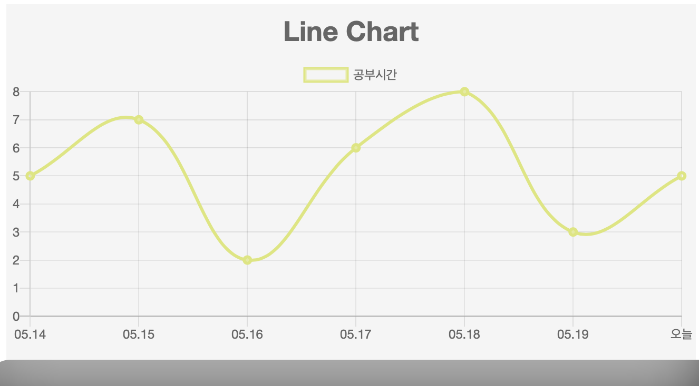
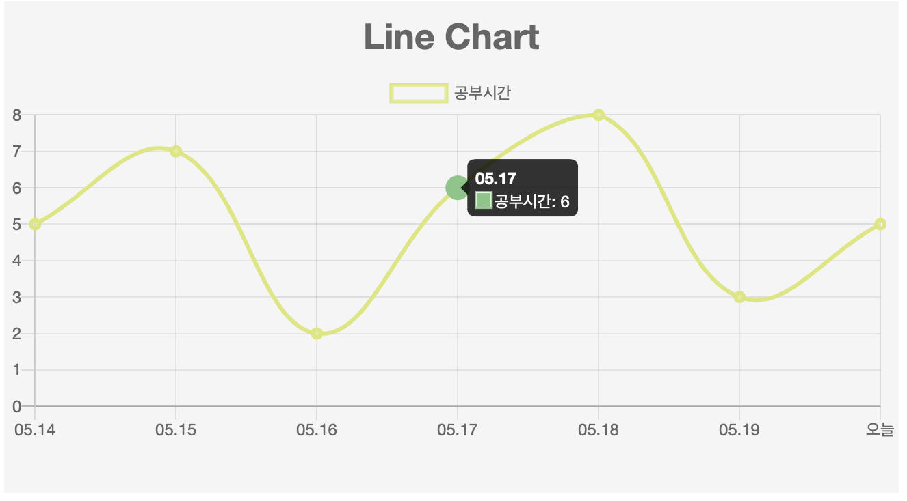
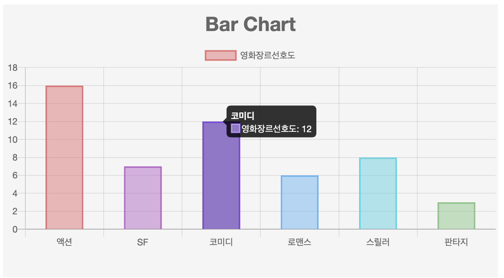
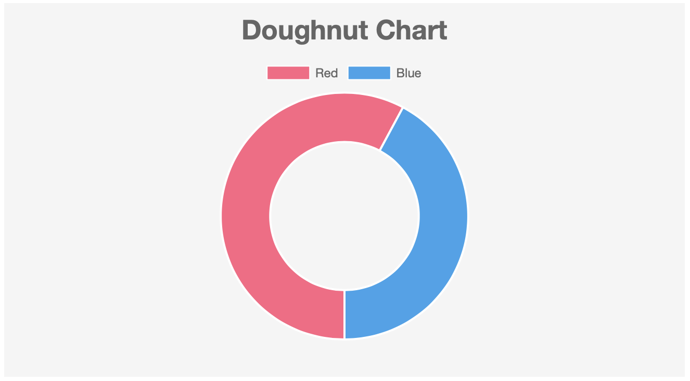
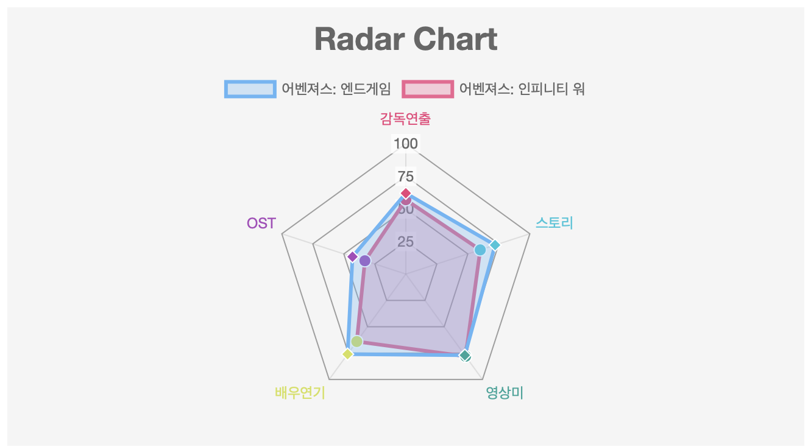
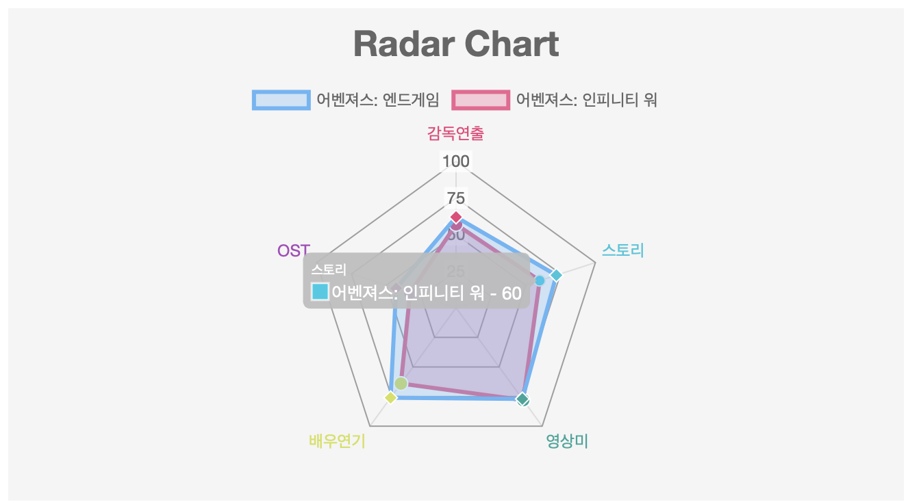
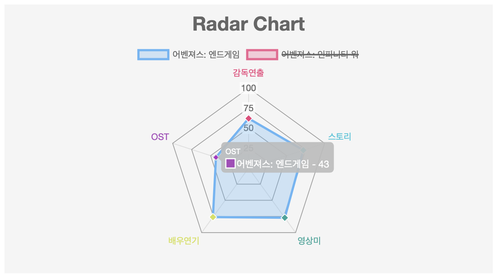

# Chart.js


### Line Chart






```javascript

var $line = $("#line");

   var lineChart = new Chart($line, { //차트 선언
    type: 'line', //차트 타입

    data: // 차트 데이터

    {
      //라벨 배열
        labels: ["05.14","05.15","05.16","05.17","05.18","05.19","오늘"], //x축 데이터
        datasets: [{ //데이터 오브젝트 배열
          label: '공부시간', //데이터 이름
          backgroundColor: 'rgba(245,245,245,0.3)', 
          borderColor: 'rgb(220, 231, 117)', // 보더 색
          borderWidth: 3, //보더 넓이
          hoverBorderWidth:10, // hover시 보더 넓이
          hoverBorderColor:'#81C784', //hover시 보더 색깔
          hoverBackgroundColor:'#81C784', // hover시 tooltip에서 나타나는 데이터 색상
            data: [5, 7, 2, 6, 8, 3, 5] //y축 데이터 
            
          }]
        },

    options: { //차트 옵션 - 애니메이션, 레이아웃, 차트제목, 툴팁, 스케일(범위) 등 차트를 구성하는 요소들에 대한 부가설정 가능
     title:{ //차트 제목 설정
      display: true, 
      text: "Line Chart",
      fontSize: 26
    },
      scales : { //범위에 대한 설정
        yAxes: [{ //y축의 스케일
          ticks:{// 축상의 위치 표시 기준을 설정
            beginAtZero: true //y축 시작을 0으로 
          }
        }]

      }//scales end

    }
  });

```


### Bar Chart




```javascript
  var $bar = $("#bar");

  var barData = {
    labels: ["액션","SF","코미디","로맨스","스릴러","판타지"], //x축
    datasets: [{ //데이터 오브젝트 배열
      label: '영화장르선호도',
      fill : false,
      backgroundColor: ['rgba(229,115,115,0.5)','rgba(186,104,200,0.5)','rgba(149,117,205,0.5)',
      'rgba(100,181,246,0.5)','rgba(77,208,225,0.5)','rgba(129,199,132,0.5)'],

      borderColor: ['rgba(229,115,115,1)','rgba(186,104,200,1)','rgba(149,117,205,1)',
      'rgba(100,181,246,1)','rgba(77,208,225,1)','rgba(129,199,132,1)'],
      borderWidth: 2,

      hoverBackgroundColor:['rgba(229,115,115,1)','rgba(186,104,200,1)','rgba(149,117,205,1)',
      'rgba(100,181,246,1)','rgba(77,208,225,1)','rgba(129,199,132,1)'],
            data: [16, 7, 12, 6, 8, 3] //f(x)
          }]};
          var barChartDataArr = barData.datasets[0].data; //데이터 배열
          var barChartYMax = Math.max.apply(null,barChartDataArr)+1; //가장 큰 데이터 값에 1을 더해서 max 값 조정
          var barOptions = {
           title:{
            display: true,
            text: "Bar Chart",
            fontSize: 26
          },
          scales :{
            yAxes: [{
              ticks : {
                beginAtZero: true,
                  suggestedMax : barChartYMax //suggestedMax - max 값을 축 비율에 맞게 설정해줌 

                }
              }],
              xAxes: [{
                barThickness: 50,// bar 두께 조정 (50 - 각 x축의 넓이의 50% 크기 )


              }]
            }
          }
          //차트 선언 
          var barChart = new Chart($bar, {
            type:'bar',
            data: barData,
            options:barOptions


});//barChart end

```


### Doughnut Chart




```javascript
 var $doughnut = $("#doughnut");
  var doughnutData = {
    datasets: [{
      data: [59,43],
      backgroundColor: ["rgb(255, 99, 132)","rgb(54, 162, 235)"],
      hoverBackgroundColor: ["rgba(255, 99, 132,0.7)","rgba(54, 162, 235,0.7)"],
      hoverBorderColor: ["rgba(255, 99, 132,1)","rgba(54, 162, 235,1)"],
      hoverBorderWidth: 6
    }],

    labels: [
    'Red',
    'Blue'

    ]
  };
  var doughnutChart = new Chart($doughnut, {
    type: 'doughnut',
    data: doughnutData,
    options: {
     title:{
      display: true,
      text: "Doughnut Chart",
      fontSize: 26
    },
      cutoutPercentage : 60, // 도넛 가운데 구멍 크기(50은 기본 0은 꽉 막힘)
      rotation : 0.5 * Math.PI, // 시작 각도 변경 (기본: -0.5 * Math.PI) 
      animation: {animateScale: true , animateRotate: true}// 차트 나타날 때 애니메이션 

    }
  });
```


### Radar Chart







```javascript
 var $radar = $("#radar");
  var radarData = {
   labels: ["감독연출", "스토리", "영상미", "배우연기", "OST"],
   datasets: [{
    label:"어벤져스: 엔드게임",
    data: [62, 72, 77, 76, 43 ],
    backgroundColor: "rgba(100,181,246,0.3)",
    borderColor:"rgba(100,181,246,1)",
    pointBorderColor:"#fff",
    pointRadius:5,
    pointBorderWidth:1,
    pointStyle:"rectRot",
    pointBackgroundColor:["#EC407A","#26C6DA","#26A69A","#D4E157","#AB47BC"]


  },{
    label:"어벤져스: 인피니티 워",
    data: [57, 60, 78, 64, 33 ],
    borderColor:"rgba(240,98,146,1)",
    backgroundColor:"rgba(240,98,146,0.3)",
    pointBorderColor:"#fff", 
    pointRadius:5, 
    pointBorderWidth:1,
    pointBackgroundColor:["#EC407A","#26C6DA","#26A69A","#D4E157","#AB47BC"]
  }]
  };//radarData


  var step = 4;
  var max = 100;
  var start  = 0;

  var radarOptions =  {
   title:{
      display: true,
      text: "Radar Chart",
      fontSize: 26
     },
   scale: {
    gridLines :{ //그리드 설정
      color: "#9E9E9E",
      lineWidth: 1 //라인 넓이 설정
    },

    ticks :{
      beginAtZero: true,
      max: 100,
      stepSize: 25 //축의 너비 범위를 25 크기로 설정 0~100까지의 범위라면 0 , 25, 50, 75, 100 

    },
    pointLabels: { //포인트 라벨 설정
      fontSize: 12,
      fontColor: ["#EC407A","#26C6DA","#26A69A","#D4E157","#AB47BC"]
    }}, 
    elements:{ //차트를 구성하는 요소
    line:{ //선
      tension:0, // 베지어 곡선 설정
      borderWidth:3 
    }},
    tooltips: {

      titleFontSize: 10,
      backgroundColor: 'rgba(189,189,189,  0.9)',
      titleFontStyle: 'normal',
      bodyFontSize: 13,
      callbacks: { 
        label : function(tooltipItem, data){ 
       var label = data.datasets[tooltipItem.datasetIndex].label; //데이터 라벨 

       if (label) {
        label += ' - '; 
      }
      label += tooltipItem.yLabel; //라벨에 데이터 값을 붙임 
     // console.log(data.datasets[tooltipItem.datasetIndex].label);
     return label;
   }

 }
}

  }//options end

  var radarChart = new Chart($radar, {
    type:'radar',
    data : radarData,
    options: radarOptions

  });//radarChart end 
```

