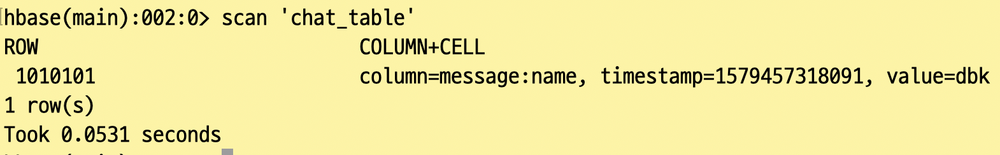

```
$ wget http://mirror.navercorp.com/apache/hbase/2.2.2/hbase-2.2.2-bin.tar.gz
```

```vin
$ tar xvfx hbase-2.2.2-bin.tar.gz
```

```
$ ln -s hbase-2.2.2/ hbase
```

```
$ sudo vi /etc/profile
```

```
$ vi hbase-site.xml
```

```
$ vi regionservers
```

```
$ tar cvfz hbase.tar.gz hbase-2.2.2/
```

```
scp hbase.tar.gz bigdata@server02:/home/bigdata
scp hbase.tar.gz bigdata@server03:/home/bigdata
scp hbase.tar.gz bigdata@server04:/home/bigdata

 ssh bigdata@server02 "cd /home/bigdata; tar xvfz hbase.tar.gz"
 ssh bigdata@server03 "cd /home/bigdata; tar xvfz hbase.tar.gz"
 ssh bigdata@server04 "cd /home/bigdata; tar xvfz hbase.tar.gz"
```

```
 ssh bigdata@server02 "ln -s hbase-2.2.2 hbasa"
 ssh bigdata@server03 "ln -s hbase-2.2.2 hbase"
 ssh bigdata@server04 "ln -s hbase-2.2.2 hbase"
```

```
$ ssh bigdata@server02 "mkdir /home/bigdata/var/hbase"
$ ssh bigdata@server03 "mkdir /home/bigdata/var/hbase"
$ ssh bigdata@server04 "mkdir -p /home/bigdata/var/hbase"
```

하둡 3.1.x 부터는 hbase 2.1.x+

