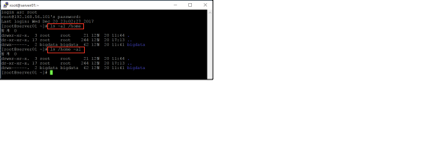

# 리눅스 기초 

## 리눅스 디렉토리 구조

- / : 최상위 디렉터리, root
- /bin : Binary의 약자, 기본 실행 파일들(사용자 명령어)이 위치해있음
- /boot : 시스템 부팅에 필요한 파일들 위치 
- /dev : Device의 약자, 하드디스크와 CD롬 등의 장치 파일을 모아놓음
- /etc : 시스템 설정 파일이 들어가 있음
- /home : 사용자의 계정의 홈디렉토리(root 사용자의 홈디렉토리는 /root)
- /mnt : 마운트 될 파일 시스템의 마운트 포인터(마운트 될 위치)가 되는 디렉토리들이 이 디렉토리 안에 있음. 장치가 연결되면 /mnt 안에 있는 해당 디렉토리에 위치함 (예: /mnt/cdrom)
- /lib : Library의 약자, 각종 라이브러리가 저장되어 있음. 라이브러리는 프로그래밍에서 함수같은 것이며 커널 모듈도 여기에 위치
- /proc : 시스템 관리를 목적으로 메모리상에 만들어놓은 가상 디렉터리. 기본적으로는 /prox는 커널이 가지고 있는 여러가지 데이터 구조를 시스템 관리자에게 쉽게 전달하기 위해서 사용하는 목적으로 만들어져 있음. 
- /root : 루트 사용자의 홈디렉터리. 다른 일반 사용자들은 이 디렉터리에 접근 못함
- /sbin : 시스템 점검 및 복구 명령, 네트워크 인터페이스 설정 명령, 시스템 시작 및 종료 명령, 커널 모듈 등 시스테 관리에 관련된 실행 파일들이 있음
- /tmp : 시스템에 필요한 임시 파일들을 만들고 삭제하는 디렉터리 
- /usr : 시스템이 정상적으로 가동되는데 필요한 모든 명령과 라이브러리, 메뉴얼 페이지가 저장된 디렉터리 
- /var : 자료 데이터가 변경될 때 저장되는 디렉터리. 시스템의 작동 로그들과 네트워크, 보안 관련 로그 등 각종 로그 파일이 저장되는 디렉터리   

## 명령어 사용법

> 명령어 [–옵션] [파일] 또는 명령어 [파일] [–옵션]

