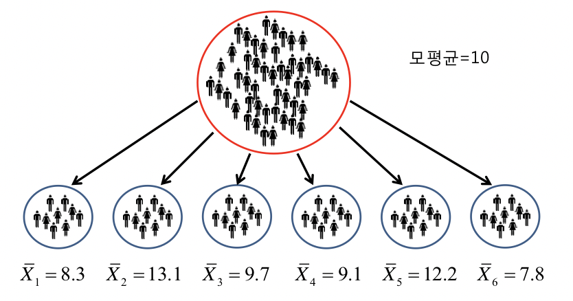
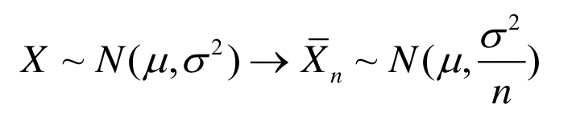

[TOC]

# 표집분포의 이해

## 모수(Parameter)와 통계량

- <u>추론: 주어진 표본으로부터 모집단의 성격을 추측하는 것</u>
- <u>모수: 수치로 표현되는 모집단의 특성(모평균, 모분산 등등)</u>
- <u>통계량: 표본의 관측값들에 의해 결정되는 표본자료의 특성</u> 
- <u>추정: 통계량을 사용하여 모수를 추론하는 것</u> 

### 통계량의 특징

- 표본의 통계량은 모수의 추정치이지만 일반적으로 모수의 참값과 일치 하지 않음
- 통계량의 값은 추출된 표본에 영향을 받음
- 같은 크기(표본수)의 표본이라도 새로운 표본을 추출할 때 마다 통계량의 값은 변함

## 통계량의 확률분포

### 표집분포

- 하나의 모집에서 서로 다른 많은 표본이 추출될 수 있음
- 각 표본마다 계산된 통계량도 서로 다른 값을 갖음
- 통계량의 값은 그 자체가 확률변수가 됨
- 통계량들의 분포로 확률분포를 만들 수 있음
- **하나의 모집에서 추출할 수 있는 가능한 모든 표본에서 계산된 통계량의 확률 분포를 표집분포라고 함** 

### 모집단을 알고 있을 때 통계량의 표집분포 구하기

- 모든 가능한 표본을 나열
- 각 표본에서 통계량을 구함
- 통계량이 취하는 각 값에 대응되는 확률을 계산
- 한계
  - 모집단을 알고 있어도 모집과 표본의 크기가 커지면 모든 표집을 찾아 통계량의 표집분포를 구하기 어려움
  - 모집단의 크기가 큰 경우는 표집 분포의 특성을 이용해 통계량의 표집 분포를 추정 가능

### 표본평균 표집분포의 특성

- 평균의 표집분포의 기대값(평균)과 분산은 다음과 같은 특성이 있음
- 평균의표집분포의 기대값(평균의 평균)은 모집단의 평균과 같음
- **평균의 표집분포의 분산**은 **모집의 분산을 표본 크기 $n$으로 나누어준 값**과 같음 
  - 표본을 많이 뽑을 수록 표집분포는 촘촘해지기 때문에(반비례하기 때문에) 분산이 작아짐
  - 표준오차가 작다 = 평균의 표집분포의 폭이 좁다 = 표본평균이 모평균과 가깝다

- 모집이 정규분포가 아닐 때(중심극한정리)
  - 표본의 크기가 큰 경우(보통 30 이상) 표본크기 $n$인 평균의 표집 분포는 평균이 $μ$ , 분산이 $σ^2/n$인 정규분포와 매우 유사함
  - 표본의 크기가 커질 수록 평균의 표집분포는 정규분포에 더 가까워짐

