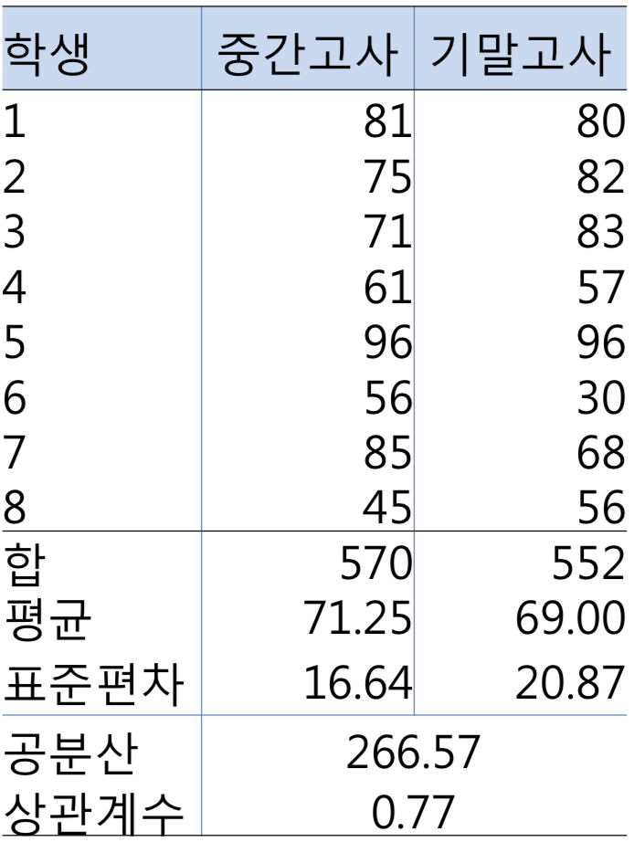
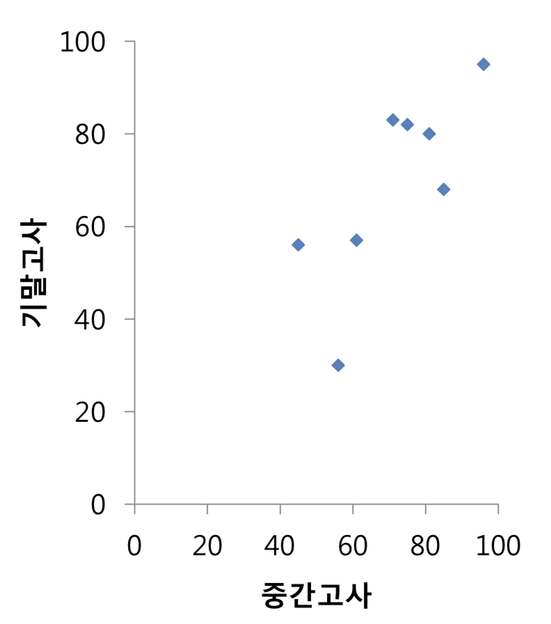

# 회귀분석

## 두 연속 변인의 관계

### 두 연속변인의 선형관계

#### 두 연속변인의 관계에 대한 질문

|                                                              |                                                              |
| ------------------------------------------------------------ | ------------------------------------------------------------ |
|  |  |

- 중간고사 점수와 기말고사 점수는 서로 관련이 있는가?
- 서로 관련이 있다면 얼마나 밀접한가?
- 중간고사 점수로 기말고사 점수를 예측 할 수 있을까?

#### 완벽한 선형적 관계(일차 함수)

​	

## 표본 회귀식

## 모집 회귀식

## 모집 회귀식의 추정